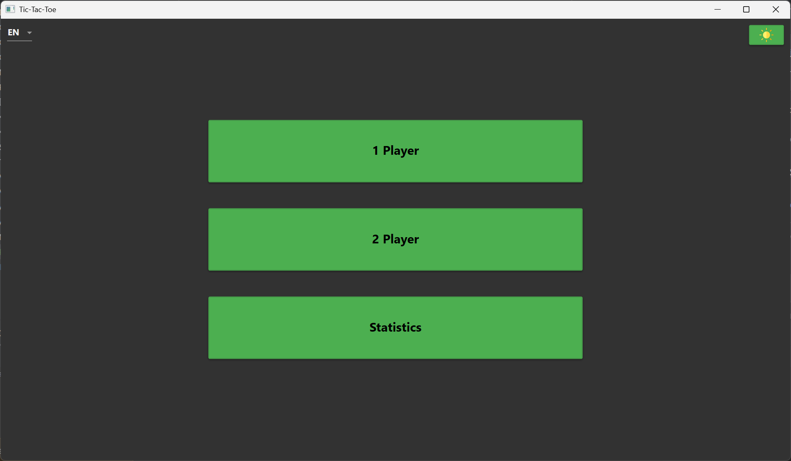
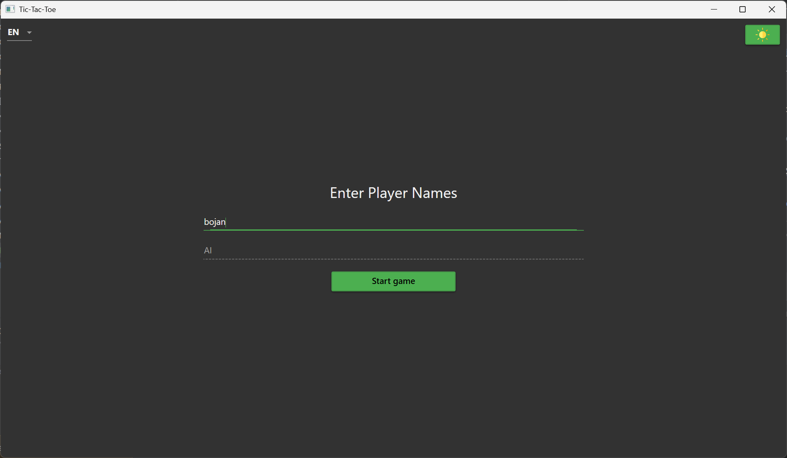
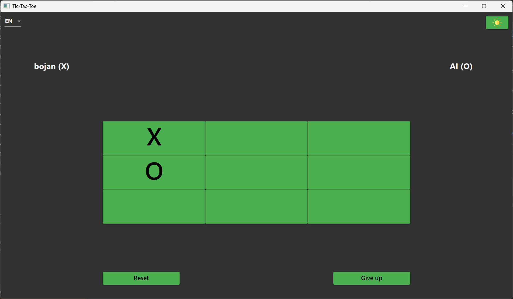
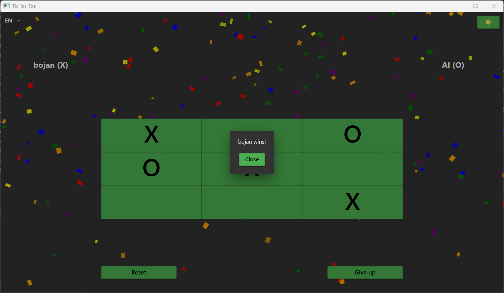
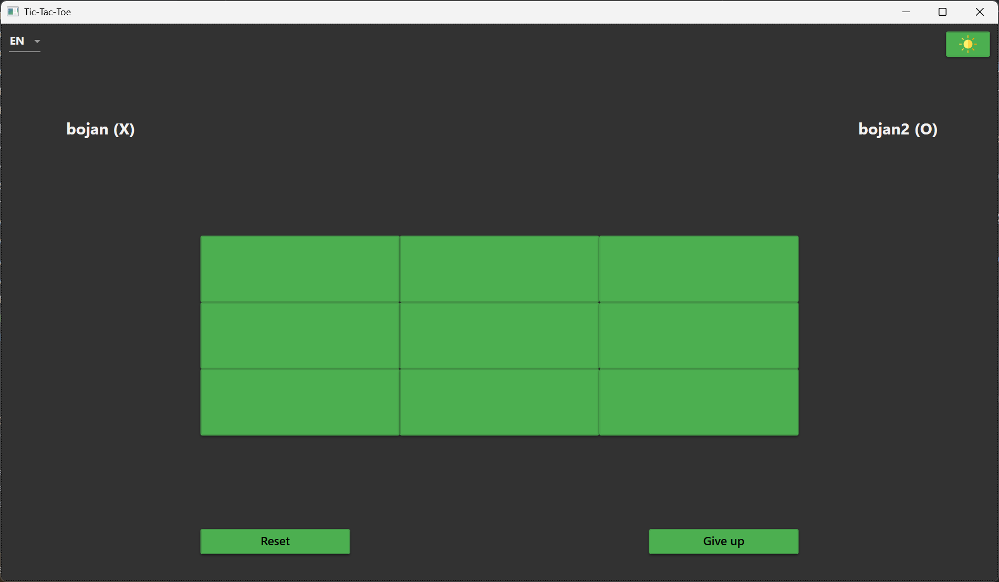
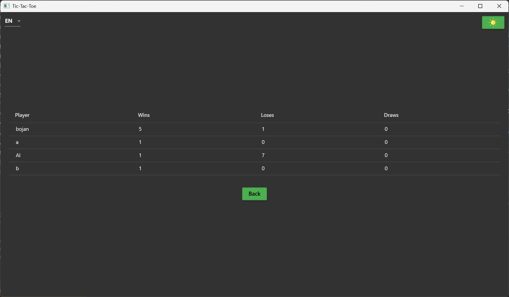

# XO Game

A modern implementation of the classic Tic-Tac-Toe game built with C# and WPF.

## Features

- 🎮 Classic Tic-Tac-Toe gameplay
- 👥 Two-player mode with customizable player names
- 📊 Statistics tracking (wins, losses, draws)
- 🌐 Multi-language support (English, German)
- 🎨 Clean, modern UI with Material Design

## Screenshots

## How to Play

1. Start the application
2. Enter player names
3. Choose your preferred language from the dropdown
4. Players take turns placing X's and O's on the 3×3 grid
5. First player to get three in a row (horizontally, vertically, or diagonally) wins
6. View game statistics to track player performance

## Language Support

The game supports multiple languages:
- English (EN)
- German (DE)

Select your preferred language using the language dropdown in the top-left corner.

## Technologies Used

- C# / .NET
- WPF (Windows Presentation Foundation)
- MVVM Architecture
- Material Design UI

## Installation

1. Clone the repository
2. Open the solution in Visual Studio
3. Build and run the application

## Development

This project follows the MVVM (Model-View-ViewModel) pattern for clean separation of UI and business logic.

### Project Structure
- `Models/`: Game data structures
- `ViewModels/`: Application logic
- `Views/`: UI components
- `Resources/`: Localization files
